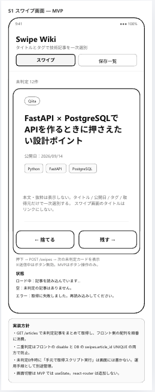
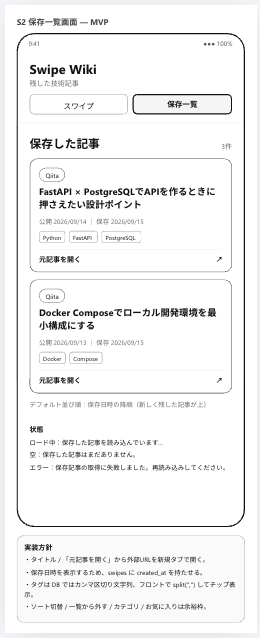

# Swipe Wiki

技術記事をスワイプで仕分けるWebアプリ。Qiitaの記事を1件ずつカードで見て、右(残す)/左(捨てる)を判定し、残した記事の一覧から元記事へ飛べる。

- 記事の本文は保存しない(外部URLへのリンクのみ)
- 1人用・認証なし

## 画面構成(WF)

| S1 スワイプ画面 | S2 保存一覧画面 |
|---|---|
|  |  |

## 技術構成
- Backend: Python / FastAPI / SQLAlchemy / PostgreSQL
- Frontend: React / TypeScript / Vite
- Infra: Docker / Cloud Run / Cloud SQL

## 設計ドキュメント
- [要件定義](docs/SwipeWiki_01_要件.md)
- [DB設計](docs/SwipeWiki_04_DB設計.md)
- [API定義](docs/SwipeWiki_03_API定義.md)

開発中。
