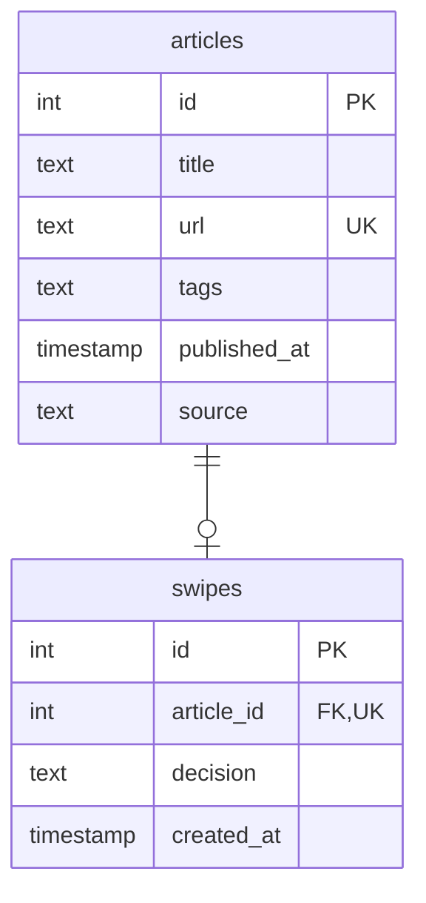

## articles

| 列           | 型                   | ルール                                       |
| ------------ | -------------------- | -------------------------------------------- |
| id           | 数字                 | 自動でふえる番号                             |
| title        | 文字                 | 空はダメ                                     |
| url          | 文字                 | 空はダメ。同じURLを2回入れないルールを設ける |
| tags         | 文字（カンマ区切り） | タグなしの記事はOK                           |
| published_at | 日付+時刻            | 空はダメ                                     |
| source       | 文字                 | 空はダメ（"qiita"）                          |

---

## swipes

| 列         | 型                    | ルール                                 |
| ---------- | --------------------- | -------------------------------------- |
| id         | 数字                  | 自動でふえる番号                       |
| article_id | 数字                  | 記事の表のidを指す。1記事に1つだけ     |
| decision   | 文字("keep" / "drop") | 空はダメ                               |
| created_at | 日付+時刻             | 自動で今の時刻（S2の「保存日」に使う） |

---

